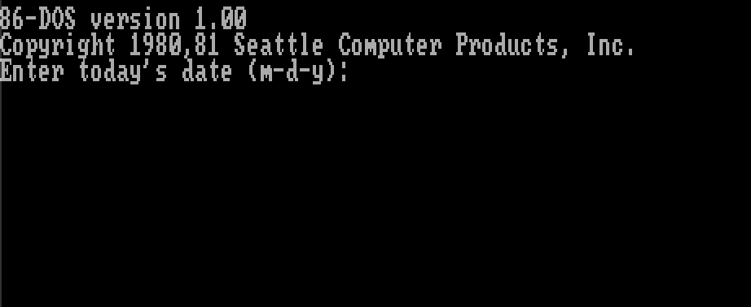
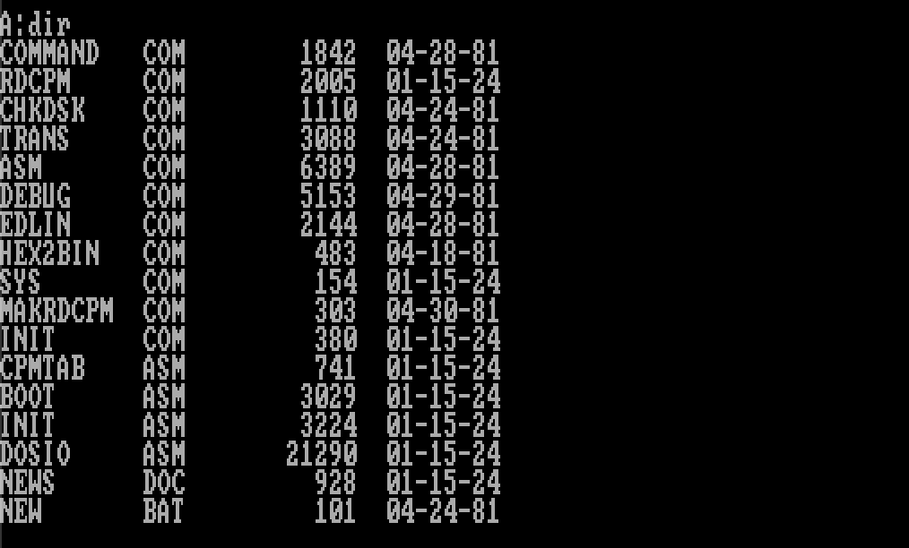

# 86-DOS 1.00 — The Original DOS, Compiled from Source and Running

Build and boot Tim Paterson's **86-DOS 1.00** (April 28, 1981) from the original assembly source code. This is the operating system Microsoft purchased and shipped as MS-DOS — the OS that launched the PC revolution.



## What is this?

In 1980-81, Tim Paterson at Seattle Computer Products wrote an operating system for the Intel 8086 called **86-DOS** (originally "QDOS" — Quick and Dirty Operating System). Microsoft licensed it in 1981, and it became **MS-DOS 1.0** — the foundation of the IBM PC software ecosystem.

This project takes Paterson's [original handwritten source code](https://github.com/DOS-History/Paterson-Listings) (transcribed from physical printer listings), cross-assembles the kernel using a reimplementation of the SCP assembler running in Docker, patches 49 bytes of IBM PC keyboard mappings, and boots the result in an emulator.

**You are running a kernel compiled from the actual source code that started it all.**

## Quick Start

### Prerequisites

- [Docker](https://www.docker.com/products/docker-desktop/)
- [DOSBox-X](https://dosbox-x.com/) — `brew install dosbox-x` on macOS
- Python 3
- `git`

### Build & Run

```bash
git clone https://github.com/phyous/DOS-1.0.git
cd DOS-1.0

# Compile the kernel from original source (uses Docker)
./build.sh

# Boot 86-DOS in DOSBox-X
./run.sh
```

When prompted for a date, enter something like `1-1-81` (86-DOS only accepts years 1980-1999).



## How It Works

### 1. Cross-Assembly in Docker

The original source ([`86DOS.ASM`](https://github.com/DOS-History/Paterson-Listings/blob/main/3_source_code/86-DOS_1.00/86DOS.ASM)) uses the **SCP assembler syntax** — a non-standard 8086 assembly dialect that no modern assembler understands natively. The [pts-86-dos-reconstruction](https://github.com/pts/pts-86-dos-reconstruction) project provides `asm244l`, a faithful reimplementation of Tim Paterson's SCP ASM v2.44 that runs on Linux x86.

`build.sh` spins up a Docker container to:
1. Compile the `asm244l` cross-assembler from NASM source
2. Assemble `86DOS.ASM` into `86DOS.bin` — the **5,446-byte kernel** — with zero errors
3. Patch 49 bytes of IBM PC keyboard scan codes (the original source uses SCP keyboard mappings)
4. Write the compiled kernel into a bootable 160KB floppy disk image

### 2. The 49-Byte Patch

The source code was written for Seattle Computer Products hardware, which had different keyboard escape sequences than the IBM PC. The only modification to the compiled binary is replacing 49 bytes of SCP keyboard scan codes with their IBM PC equivalents — everything else runs exactly as Paterson wrote it.

### 3. Booting with DOSBox-X

86-DOS runs on an Intel 8086 with CGA display. DOSBox-X emulates this hardware. The floppy image includes the kernel we compiled plus these utilities (from the [IBM PC adaptation](https://github.com/TheBrokenPipe/86-DOS_PCAdaptation)):

| File | Size | Description |
|------|------|-------------|
| `COMMAND.COM` | 1,842 | Command interpreter (shell) |
| `ASM.COM` | 6,389 | SCP 8086 assembler |
| `DEBUG.COM` | 5,153 | Machine-level debugger |
| `EDLIN.COM` | 2,144 | Line editor |
| `CHKDSK.COM` | 1,110 | Disk integrity checker |
| `HEX2BIN.COM` | 483 | Intel HEX to binary converter |
| `TRANS.COM` | 3,088 | File transfer utility |

### 4. What's in the Kernel

The entire operating system fits in **5,446 bytes**. It implements:

- **FAT12 filesystem** — 12-bit file allocation table, the format that would dominate PC storage for 15+ years
- **INT 21h API** — 36 system calls for file I/O, console input/output, and memory management
- **FCB-based file access** — File Control Blocks inherited from CP/M
- **Console line editing** — built-in command line editing with escape-key shortcuts
- **Device driver interface** — abstraction layer for console, printer, and auxiliary I/O

## The Source Code

The source comes from the [DOS-History/Paterson-Listings](https://github.com/DOS-History/Paterson-Listings) repository, which contains transcriptions of Tim Paterson's original printer output. The repo is organized in three layers:

```
1_transcription/   Raw printer output (ASCII art banner pages and all)
2_printed_files/   Individual .ASM/.PRN files extracted from the printouts
3_source_code/     Cleaned-up, directly assemblable source  <-- we build from here
```

The assembly source is a single file — [`86DOS.ASM`](https://github.com/DOS-History/Paterson-Listings/blob/main/3_source_code/86-DOS_1.00/86DOS.ASM) — containing the complete operating system kernel in ~1,200 lines of 8086 assembly, including Tim Paterson's original comments and revision history dating back to December 1980.

## Things to Try

Once booted to the `A>` prompt:

```
DIR                    List all files on the floppy
CHKDSK                 Check disk and show free space
TYPE NEWS.DOC          Read the 86-DOS release notes
TYPE CPMTAB.ASM        View assembly source code on disk
ASM CPMTAB             Assemble it with the original SCP assembler
DEBUG                  Enter the debugger:
  D 0:0                  Dump the interrupt vector table
  U 60:0                 Disassemble the running DOS kernel
  Q                      Quit debugger
EDLIN TEST.TXT         Create a file with the line editor:
  I                      Insert mode
  Hello from 1981!       Type some text
  ^C                     Exit insert mode
  E                      Save and exit
```

## Credits & Sources

- **[DOS-History/Paterson-Listings](https://github.com/DOS-History/Paterson-Listings)** — Transcription of Tim Paterson's original DOS source code printouts (MIT License)
- **[pts/pts-86-dos-reconstruction](https://github.com/pts/pts-86-dos-reconstruction)** — SCP cross-assembler reimplementation and build tools
- **[TheBrokenPipe/86-DOS_PCAdaptation](https://github.com/TheBrokenPipe/86-DOS_PCAdaptation)** — IBM PC adaptation of 86-DOS (boot sector, BIOS layer, COMMAND.COM)
- **[DOSBox-X](https://dosbox-x.com/)** — Accurate DOS/PC emulator

## License

The 86-DOS source code in the [Paterson-Listings](https://github.com/DOS-History/Paterson-Listings) repository is released under the MIT License. The build tooling in this repository is also MIT.
